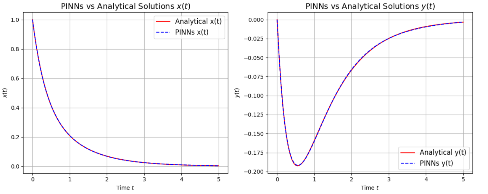

# Physics_Informed_Neural_Nets_PINNs
Some classic Physics-based Differential Equations solved with the help of Neural Networks



# How to run?
### STEPS:

Clone the repository

```bash
https://github.com/Chatterjee-Arpan/Physics_Informed_Neural_Nets_PINNs.git
```
### STEP 01- Create a .env file in your root directory to store your OpenAI API key for LLM integration (only for `PINNs_Schrodinger_Equation_LLM_Int.ipynb`)

```bash
OPENAI_API_KEY=###############################
```
### STEP 02- Run the respective .ipynb files
**That's it!**

The following is a description of the components in this repo:
- **PINNs–Schrodinger_Equation_LLM_Int.ipynb**
  Integrates GPT 3.5-Turbo to dynamically assign Learning Rates and control the Number of Epochs to train the PINN. The Training is done in short bursts of Epochs. The LLM analyzes the Loss trend to decides whether to go for the next burst of epoch or not. It also decides the learning rate for the burst.
  
- **PINNs–Schrodinger_Equation.ipynb**  
  Applies PINNs to approximate solutions of the time‑dependent Schrödinger equation.

- **PINNs–Newton’s_Law_of_cooling.ipynb**  
  Demonstrates a PINN approach to modeling exponential temperature decay in Newton’s law of cooling.

- **PINNs–Neumann_Dirichlet.ipynb**  
  Enforces mixed Neumann and Dirichlet boundary conditions in a PINN framework for PDEs.

- **PINNs–System_of_ODEs.ipynb**  
  Solves coupled systems of ordinary differential equations using physics‑informed neural networks.

- **PINNs–Solving_ODE.ipynb**  
  Uses PINNs to learn the solution of a single ordinary differential equation from data.
